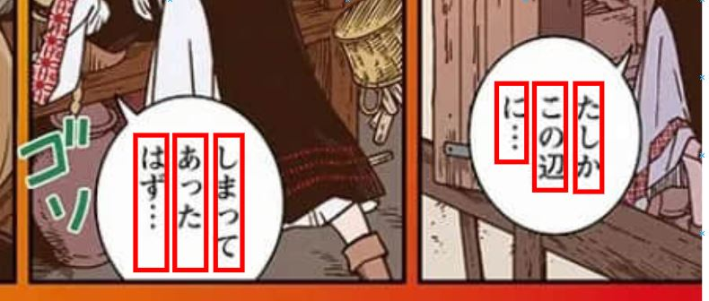
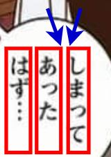

# manga-translator

Just do easy one first, if success can put in more effort.

## Steps 
Step 1: Create dataset, 
- Use the method that you create answer sheet, around 75 pages first.
- The japanese manga can be found here <a href='https://www.zerobywzio.com/plugin.php?id=jameson_manhua&a=ku&shuxing=%E5%85%A8%E7%94%9F%E8%82%89&'>zero manga</a>.
- Because comic sentences is from top right to bottom first, so just label the boundary for every vertical line(Just ignore horizontal first text).
 
  

Step 2: word extraction
- Crop out the text, and detect whether it is in onsentences (using corner to define). 
  
- Use the top-left & top-right corner to define whether they are in same paragraph or not.
- Combine all related words into 1 sentences image.
- For every sentence images, Using tesseract library to read the words, so it will become text from image.
  
Step 3: Translation
- Using existed API to sent to Google translate, the library name is 'googletrans'.

Step 4: Record/Display
- just record as text first, don't think on replacing the original text inside image.
  
Step 5: Enable real time running
- Make a function to run it continuously(every second scan one times and display translated text on cmd)

## Further Enhancement
https://github.com/KUR-creative/SickZil-Machine  
https://github.com/dalelyunas/manga-translator

未来日本漫画盗版吃广告费不是梦~